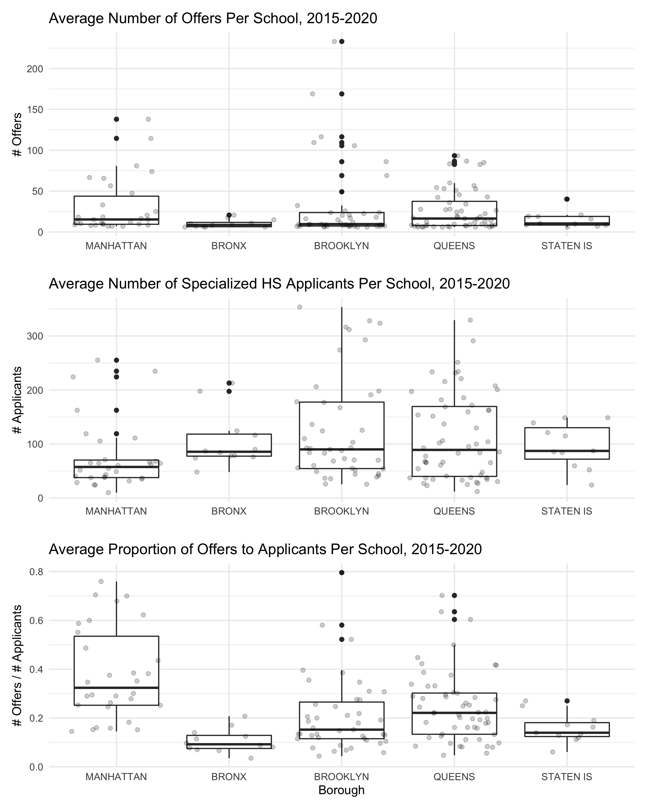

```{r setup, include=FALSE}
library(tidyverse)
library(ggplot2)
library(lubridate)
library(plotly)
library(viridis)

getwd()
knitr::opts_chunk$set(
  fig.width = 6,
  fig.asp = .6,
  out.width = "90%"
)
theme_set(theme_minimal() + theme(legend.position = "bottom"))
options(
  ggplot2.continuous.colour = "viridis",

  ggplot2.continuous.fill = "viridis"
)
scale_colour_discrete = scale_colour_viridis_d
scale_fill_discrete = scale_fill_viridis_d
```

*The home page can be accessed [here](index.html)*.

### Distribution of Admissions Offers By Borough, All Years

To begin, we wanted to understand the landscape of the specialized high school admissions process more generally.

##### Number of Offers Received, Number of Specialized High School Applicants, and the Proportion of Offers Per Applicants



These plots demonstrate that there is a wide spread in the number of offers of admission students receive at a given middle school, a wide spread in the number of students applying to specialized high schools, and a large spread in the fraction of those students applying to specialized high schools who receive an offer, between the five boroughs of New York City. Brooklyn and Queens had the greatest variability in all variables, with a large number of both specialized high school applicants and offers in some middle schools, and few of either offers or applicants in other middle schools. Manhattan, though it did not have the largest number of offers or testers overall, has the greatest number of offers per number of students applying to specialized high schools.

As it represents a school's success rate in specialized high school admissions, we found the proportion of offers to applicants to be the best summary of the trends in specialized high school applications, and used these data in our results.

##### Relationship Between Prevalence of Specialized High School Applicaitons within a School and Number of Admissions

Since applying to most high schools and to specialized high schools are two separate processes, we were interested in whether there is a relationship between how common it is to apply to specialized high schools at a given middle school, and how many specialized high school admissions offers that school receives. The X axis describes: out of the students applying to high school, how many are also applying to specialized high schools? The Y axis then adds: how many students receive offers to specialized high schools for different prevalence of specialized high school applications?


In the Bronx and on Staten Island, there are few schools where a majority of the students applying to high school are additionally applying to specialized high schools, and of the students who do apply to specialized high schools, few receive an offer. 

In Brooklyn, Manhattan, and Queens, the greatest proportion of admissions offers per specialized high school applicant are received at schools where most students apply to specialized high schools. There are some interesting exceptions in Manhattan, where there are few students who apply to specialized high schools, but of those, most get in. In Brooklyn and Queens, there are some schools where most students apply to specialized high schools, but few get in. Overall, these data suggest that the middle school a student attends is strongly correlated with how likely that student is to be offered admission to a specialized high school. 

### Associations Between COVID Death Rate, COVID Positivity Rate, and Specialized High School Admissions

We next wanted to understand whether the COVID-19 pandemic affected success in specialized high school admissions for 2020.


There appears to be a weak negative linear association between the average COVID-19 percent positivity rate testing and the average number of offers for middle schools within a particular ZCTA. This suggests that zip codes that had high COVID-19 case rates also tend to have middle schools where few students receive admissions offers to specialized high schools. There appears to be no relationship between the average number of offers and the cumulative average COVID-19 death rate per 100,000.  Thus our prediction for our linear models is that there will be an association with the COVID test positive rate, but no association with the average death rate.


Separating these data by borough suggests a stronger negative association between percent positivity rate and number of offers to specialized high schools in Manhattan and Queens, and a weaker association in the Bronx, Brooklyn, and on Staten Island. Oddly, in Brooklyn and Queens, there seems to be a positive association between the COVID-19 death rate per 100,000 within a zip code and the number of admissions offers received.

### Monthly Death Rate by ZCTA 
We were curious to see how death rates changed over time in each ZCTA. Below is 
a graph of what we found. The most deaths were reported in April compared to other
months, although there were many NAs in the data set.
```{r, collapse=TRUE}
COVID_deathrate <- read_csv("raw_data/deathrate_byzcta_clean.csv") %>% 
  pivot_longer(
    '3/2020':'12/2020',
    names_to = "date",
    values_to = "death_rate" 
  ) %>% 
  mutate(date = as.factor(date)) %>% 
  mutate(modzcta = as.character(modzcta)) %>% 
  rename("ZCTA" = modzcta)

plot = ggplot(COVID_deathrate, aes(x = date, y = death_rate, color = ZCTA)) +
  geom_line(aes(group = ZCTA)) +
  geom_point(alpha = .55) + 
  theme(legend.text = element_text(size = 6), 
        axis.text.x = element_text(angle = 45)) +
  labs(
    title = "COVID-19 Death Rate per 100,000\n in 2020 by ZCTA",
    x = "Date",
    y = "COVID-19 Death Rate\n (deaths/100,000)") 

ggplotly(plot)
```

