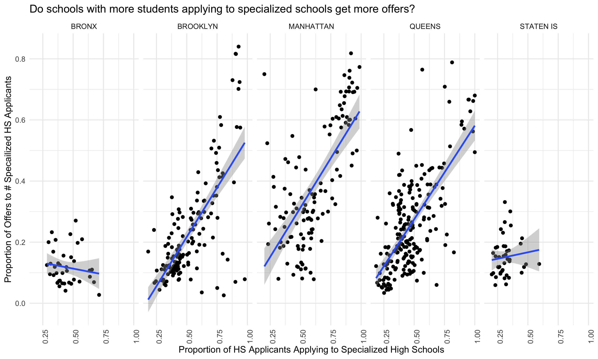
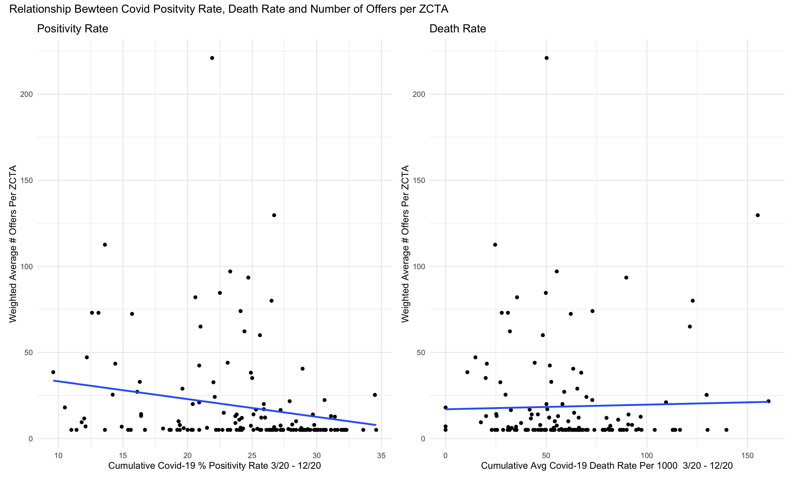

Lets head back to the [index](index.html) page.

### Distribution of Admissions Offers By Borough, All Years

To begin, we wanted to understand the landscape of the specialized high school admissions process more generally.

#### Number of Offers Received, Number of Specialized High School Applicants, and the Proportion of Offers Per Applicants

These plots demonstrate that there is a wide spread in the number of admission offers students receive at a given middle school, the number of students applying to and the fraction of those students applying to specialized high schools who receive an offer.

FINISH THIS

We found the proportion of offers to applicants to be the best summary of the trends in which schools send, and used these data in our results.

#### Relationship Between Prevalence of Specialized High School Applicaitons within a School and Number of Admissions

Since applying to most high schools and to specialized high schools are two separate processes, we were interested in whether there is a relationship between how common it is to apply to specialized high schools at a given middle school, and how many specialized high school admissions offers that school receives. The X axis describes: out of the students applying to high school, how many are also applying to specialized high schools? The Y axis then adds: how many students receive offers to specialized high schools for different prevalence of specialized high school applications?

In the Bronx and on Staten Island, there are few schools where a majority of the students applying to high school are additionally applying to specialized high schools, and of the students who do apply to specialized high schools, few receive an offer. 

In Brooklyn, Manhattan, and Queens, the greatest proportion of admissions offers per specialized high school applicant are received at schools where most students apply to specialized high schools. There are some interesting exceptions in Manhattan, where there are few students who apply to specialized high schools, but of those, most get in. In Brooklyn and Queens, there are some schools where most students apply to specialized high schools, but few get in. Overall, these data suggest that the middle school a student attends is strongly correlated with how likely that student is to be offered admission to a specialized high school. 

### Associations Between Covid Death Rate, Covid Positivity Rate, and Specialized High School Admissions

*Figure NUMBER*

*Figure NUMBER*

However, separating data by borough reveals some what more of an association between Covid-19 positivity rates and a lower number of admissions offers to specialized high schools, particularly in Manhattan and Queens. 

ANOTHER SENTENCE ABOUT THE DEATH RATE DATA
