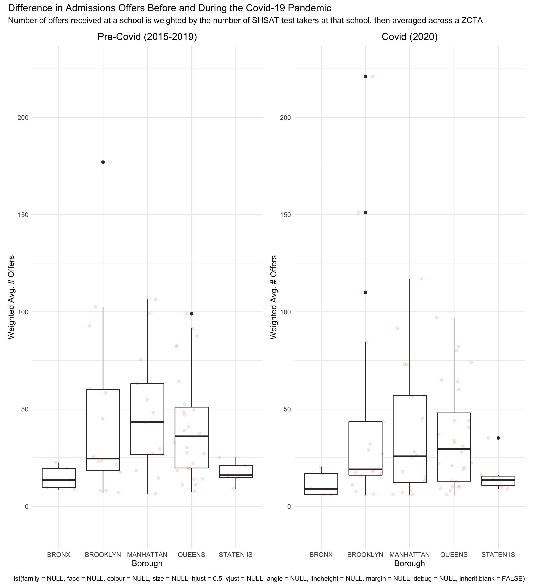

## Project Motivation
New York City has the largest public school system in the United States, with
approximately 1 million students enrolled in public schools every year, and a 
notoriously complex enrollment system. At all stages of education - elementary,
middle, and high school - students can apply outside of their district school,
often into specialized or highly selective schools. New York is unique in that a
comprehensive application for admission to a competitive, well known school can 
begin as early as pre-kindergarten.

The largest admissions process occurs for high school, where all eighth grade 
students are eligible to apply to any public high school in the city. The
official DOE [guide](https://www.schools.nyc.gov/docs/default-source/default-document-library/2021-high-school-and-specialized-high-schools-admissions-guide----guide-to-the-shsat) to high school
admissions for 2021 splits the high school admissions process into applications 
for non-specialized and  specialized public high schools. Eighth graders who do 
not enter the high school admissions process at all receive an offer from the
closest high school that has an available seat. 

Like school systems across the country, the New York City public school system 
has had its share of disruption due to the COVID-19 pandemic. The New York Times 
recently [reported](https://www.nytimes.com/2021/10/29/nyregion/nyc-schools-enrollment-covid.html) 
that total public school enrollment decreased significantly during the pandemic, 
and both students and teachers were faced with the significant hardships that
came with the sudden, unprecedented shift to fully virtual learning. 

Due to the major challenges posed to educational systems during the pandemic, we 
were curious to see if rates of COVID-19 exacerbated existing inequalities in New
York's specialized high school system. With this project, we aimed to determine 
whether incidence and death rates of COVID-19 at the zip-code tabulation area 
(ZCTA)-level were associated the number of offers made to specialized high 
schools in 2020. 

## Related Background
Specialized high schools are a set of nine schools across New York City 
known for their academic rigor that accept students through a separate 
admissions process from general high school admissions. Though the DOE does not 
report admissions rates for each school individually, roughly only 18% of 
students in the specialized high school application process receive an offer to
one of the nine schools, according to yearly DOE [data](https://infohub.nyced.org/docs/default-source/default-document-library/shsat-statistics-sy-2014-2021.pdf).

Admission to eight of the nine schools is determined by one's score on a 
standardized entrance exam called the Specialized High School Admissions Test 
(SHSAT) administered by the NYC Department of Education. For testing-required 
schools, SHSAT scores are main selection criterion, though how highly a student 
ranks a particular school in their application can also influence admission.

Though the New York's specialized high school system has been touted as a mechanism 
for economic mobility and a means of offering an outstanding education to any 
student, the specialized high school system still reflects the segregation and
inequality rooted in the public schools. In 2014, UCLA's Civil Rights Project 
described New York State, and New York City, in particular, has having [the most segregated schools in the nation](https://www.civilrightsproject.ucla.edu/news/press-releases/2014-press-releases/new-york-schools-most-segregated-in-the-nation). A new [report](https://www.civilrightsproject.ucla.edu/research/k-12-education/integration-and-diversity/nyc-school-segregation-report-card-still-last-action-needed-now/NYC_6-09-final-for-post.pdf) 
by the same authors released in June 2021 describes the persistence of segregation
by race and poverty in the educational system from 2010-2018.

## Initial Research Questions 
As the disparities prevalent in the New York City public school and health care 
systems have come to the fore of public discussion, we chose to explore the potential 
associations between the COVID-19 pandemic and specialized high school admissions.

Questions we aimed to address are:

* Were the incidence or mortality rates of COVID-19 at the ZCTA-level associated 
with SHSAT testers and offers during 2020? 
* Is the number of SHSAT testers and offers in 2020 significantly
different from previous years?
* At the ZCTA-level, what does the geographic distribution of COVID-19 incidence 
and mortality rates, and the proportion of SHSAT offers made in 2020, look like?
* geographic distribution of the proportion of offers to applicants by borough and by zip code (borough summaries)

## Data Sources and Preparation
* **SHSAT Admissions Test Offers by Sending School (2015-2021)** Specialized 
high school admission offers by middle school (denoted by district borough number) was obtained
from [NYC Open Data](https://data.cityofnewyork.us/browse?q=SHSAT&sortBy=relevance).

* **2020 DOE Middle School Directory** Addresses and key characteristics of each sending middle school were obtained from [NYC Open Data](https://data.cityofnewyork.us/Education/2020-DOE-Middle-School-Directory/fdpt-nzk4)

* **NYC COVID-19 Positive Tests by Zip-Code** Weekly zip-code level SARS-CoV2 
testing data was compiled for New York State beginning March 1, 2020 by the
[New York State Department of Health](https://health.data.ny.gov/Health/New-York-State-Statewide-COVID-19-Testing-by-Zip-C/e7te-hhb2).

* **NYC COVID-19 Death Rates by Zip-Code** Monthly zip-code tabulation area 
(ZCTA)-level SARS-CoV2 death rate data was obtained from 
the [NYC Department of Health and Mental Hygiene](https://github.com/nychealth/coronavirus-data).

* **Crosswalk File for Zip-Code to MODZCTA** To obtain consistent area units 
across the datasets, we used a [crosswalk file](https://github.com/nychealth/coronavirus-data/blob/master/Geography-resources/ZCTA-to-MODZCTA.csv) to convert zip-codes to MODZCTAs. MODZCTAs, based on the 2010 U.S. Census, are currently 
used by the NYC DOHMH for the mapping of COVID-19. The use of MODZCTA as our 
spatial level allows us to overcome several limitations of using zip-code level
data.

* Why look at ZCTAs instead of zip-codes? 

A ZIP Code doesn’t actually refer to an area, but rather a collection of points 
that make up a mail delivery route. The modified ZCTA (MODZCTA) geography combines 
census blocks with smaller populations to allow more stable estimates of 
population size for rate calculation. Information by geography reflect people's 
MODZCTA of residence at the time of reporting, and not the location of testing, 
diagnosing, or hospitalization. 

## Methods

### Data Cleaning

#### SHSAT Data

Though charter middle schools are included in the yearly specialized high school admissions by sending school dataset, they are not included in the DOE middle school directory 

#### Covid-19 2020 Cumulative Indicence Data

The Covid-19 cumulative incidence rate in 2020 was imported directly from the github repository of the [NYC Department of Health and Mental Hygiene](https://github.com/nychealth/coronavirus-data)
This data set contains the cumulative Covid-19 positive incidence rate from March 2020 until December 2020. In this data set, a person is classified as a confirmed COVID-19 case if they test positive with a molecular test.This data set include people who live in NYC. Any person with a residence outside of NYC is not included. Children attending school and their families should be residents in NYC to do so, thus, this is a potential benefit of using this data set, which is excluding the "noise" from external individuals testing positive for Covid-19 in a neighborhood but not residing there.

### Visualizations

We created MOZCTA level interactive maps with the distribution of:
* **Cumulative death rate by 100.000 inhabitants**

* **Cumulative Covid-19 positive rate incidence between March and December 2020**

* **Proportion of Specialized High School offers received by the number of students who took the SHSAT test in 2020** 

### Analysis
We used descriptive statistics to summarize the distribution of our dependent variable: the average number of SHSAT offers in 2020 by MOZCTA, and relevant predictors: the cumulative Covid-19 positive incidence rate and the cumulative death rate from March until December 2020.

We ran chi-square tests to test if there was a significant difference between the number of offers in 2020 and the average number of offers between 2015 and 2019. Additionally, we tested if there was a significant difference between the number of applicants to specialized high schools in 2020 and the average number of applicants from 2015 until 2019.

For our secondary analysis, we excluded all schools with less than 5 students receiving offers to specialized high schools to avoid positivity violations. 
Because our dependent variable is a count (number of offers), we used a poisson linear regression. However, because the distribution of the data was overspread, the variance did not equal the mean. To avoid the violation of this assumption, we used a  Quasi-Poisson model, which assumes that the variance is a linear function of the mean. In our primary model, we calculated the change in the number of SHSAT offers by a 10% increase in the cumulative Covid-19 incidence. We progressively adjusted the model, including the total number of testers by MOZCTA. Additionally, we run a secondary model with 10% increase in the cumulative mortality rate as the main predictor.

## Results

*Figure 1: Understanding the Baseline Distribution of Specialized HS Admissions in New York City*

First, it is important to have a sense of how specialized high school applications process differ in in schools across the city. Here, the proportion of admissions offers to the number of students applying to specialized schools represents the "success rate" of each middle school. These data answer the question: "of the students applying to specialized schools, how many get in?" The red points are the underlying datapoints.

Overall, there is a large spread in the data: in some schools, a majority of the students applying to specialized high schools receive an offer, and in other schools, almost none of the students applying receive an offer from a specialized school. Brooklyn and Queens have the greatest range in proportion of offers to applicants, and the Bronx and Staten island consistently have a much lower "success rate" of offers per students applying. Manhattan consistently has the greatest number of offers per number of applicants. The observed trends are relatively stable across the years 2015-2020.

*Figure 2: Number of Offers Before and During the Covid-19 Pandemic*

The weighted average number of offers is the number of offers per school, weighted by the number of applicants at that school, averaged within a ZCTA. Pre-covid data (2015-2019) is the weighted average number of offers per ZCTA, averaged again across the years 2015-2019. The red points are the underlying datapoints.

The weighted average number of offers seems to have stayed largely the same pre- and during the Covid-19 pandemic in the Bronx and on Staten Island, while the median weighted average number of offers for zip codes Manhattan decreased in the pandemic. In Brooklyn, there are a few ZCTAs in which students had an unusually high number of offers in 2020, though the median number-of-applicant-weighted average number of offers per Brooklyn zip code is lower in 2020 than in the preceding five years.

#### Descriptive statistics
The mean and the median cumulative Covid-19 positive rate across all ZCTAs were 23.85% and 24.90%, respectively. The maximum was 88.50%, and the minimum was 9.3%.
The mean and the median cumulative death rate by 100,000 inhabitants were 56.31 and 53.60, respectively, the minimum was 0%, and the maximum was 160.43.

#### Secondary analysis
A significant difference between the number of applicants in 2020 compared to the previous 5 years was identified (p value <0.0001). However, the difference in the number of offers received during the 2020=2021 school year as compared to the previous 5 years was not significant. 

In our regression models, we identified that every 10% increase in the Covid-19 cumulative incidence rate during 2020 was associated with a 0.005 decrease in the number of specialized high school admissions offers, on average, across all boroughs in New York City. This association was statistically significant with a p value <0.05. When the model was adjusted for the number of applicants during the yearm a significant reduction of 0.004 offers by a 10% increase in the cumulative incidence of Covid-19 during 2020 was observed. The model testing the change in offers associated with an increase in the mortality rate was not significant and yield estimates with a magnitude <0.0001, thus it is not shown in the table.

## Discussion
In this project, we identified a significant difference in the number of testers between 2020 and the previous five years. We represented the distribution of the specialized high school admissions offers across NYC in a visually friendly manner, identifying the areas with higher proportion of offers in the borough of Manhattan. By contrast, the Covid-19 positive rate and cumulative mortality rate by 100,000 inhabitants was higher in the boroughs of Queens, The Bronx and Staten Island. We identified a significant association between an increase of Covid-19 incidence and a decrease in the number of offers by MOZCTA on average. Several mechanisms could explain this identified association. The pandemic has impacted human lives at several levels, including accessibility to education. We believe these findings remark those areas where most efforts to enhance students accessibility to education and exam preparation is needed. These preexisting disparities across neighborhoods are likely to be exacerbated by the pandemic, which not only impacts the students directly (i.e., by remote education, reduced hours of class), but also can impact their education through a negative impact on their families (i.e., loss of family members, decrease of median household income due to unemployment, or increased healthcare expenses  for Covid-19 hospitalizations, among other hypothetical mechanisms).

Nevertheless, this study has a serial of limitations. First of all, given the cross sectional nature of the analysis, it is impossible to understand the direction of the association. Longitudinal studies are needed, particularly documenting the same parameters over the next years as Covid-19 infections remain an issue for the community. Additional, we excluded several schools which did not have information about their zip code or MOZCTA, moreover, we excluded all the schools with less than 5 participants to avoid non positivity violations. This could be a source of selection bias, particularly tending to exclude schools with a smaller number of students. Additionally, our regression models were not adjusted for potential confounders, which represents a major limitation for the interpret ability of this association as a potential causal effect.
Nevertheless, to our knowledge, this is the first project that looked at the association between Covid-19 positivity rate and SH SAT offers during the first year of the Covid-19 pandemic. The visualization of the distribution of SH SAT offers and Covid-19 incidence an mortality, provides a useful description that allow us to identify areas where the opportunities for students to access specialized high schools are particularly low. Interestingly, these areas are those where the incidence and mortality rates are higher.

There is a need for longitudinal studies that assess this association over time, additionally, further studies should seek to include potential confounders (i.e., socioeconomic status, mental health) for the association between Covid 19 and specialized high school admissions offers.

## Contributors: Tanya Butt | Catherine Lucey | Irene Martinez Morata  

### thb2114, cml2270, im2557

