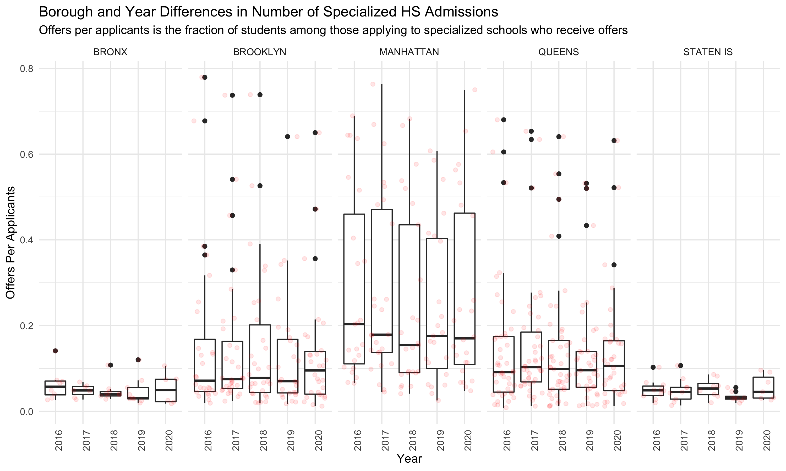

## Project Motivation

New York City has the largest public school system in the United States, with approximately 1 million students enrolled in public schools every year, and a notoriously complex enrollment system. At all stages of education - elementary, middle, and high school - students can apply outside of their district school, often into specialized or highly selective schools. New York is unique in that a comprehensive application for admission to a competitive, well known school can be prepared on behalf of a pre-kindergartner.

The largest admissions process occurs for high school, where all eighth grade students can apply out to any public high school in the city. The [official DOE guide to high school admissions](https://www.schools.nyc.gov/docs/default-source/default-document-library/2021-high-school-and-specialized-high-schools-admissions-guide----guide-to-the-shsat) for 2021 is 492 pages long, but in short: the high school admissions process is split into applications to non-specialized (most) and to specialized (a small set of 9) public high schools. Eighth graders who do not enter the high school admissions process at all receive an offer from the closest high school that has an available seat. Charter schools, which are largely separate from the public school system but still associated with the City, each have their own admissions processes and requirements. 

The specialized high schools are a set of nine schools across New York City known for their academic rigor that accept students through a separate admissions process from general high school admissions. The specialized high schools are Stuyvesant High School, often ranked as the best public high school in the country, Bronx High School of Science, Brooklyn Latin School, Fiorello H. LaGuardia High School, Brooklyn Technical High School, High School of American Studies at Lehman College, Queens High School for the Sciences at York College, and Staten Island Technical High School. Though the DOE does not report admissions rates for each school individually, roughly only 18% of students in the specialized high school application process receive an offer to one of the nine schools [according to yearly DOE data](https://infohub.nyced.org/docs/default-source/default-document-library/shsat-statistics-sy-2014-2021.pdf).

Admission to eight of the nine schools is determined by one's score on a standardized entrance exam called the Specialized High School Admissions Test (SHSAT) administered by the NYC Department of Education. LaGuardia, a performing arts high school, selects students primarily on auditions for each of the arts specialties offered there and does not require SHSAT scores. For testing-required schools, SHSAT scores are main selection criterion, though how highly a student ranked a particular school in their application can also influence admission. Though there is no entrance fee for the SHSAT, many private companies offer SHSAT test prep courses with price tags as high as [$1599](https://www.kaptest.com/shsat/courses/shsat-prep) for one on one tutoring. Indeed, though the city's specialized high school system has been touted as a mechanism for economic mobility and a means of offering an outstanding education to any student in the city, in reality the specialized high school system reflects the segregation and inequality rooted in the New York City public school system as a whole. The injustices of the New York City public school system have recently come to the fore of public discussion, and changes to the specialized high school admissions process and the desegregation of New York City's school system writ large are highly divisive and critical issues in many local elections.

Like school systems across the country, the New York City public school system has had its share of disruption due to the Covid-19 pandemic. The New York Times [recently reported](https://www.nytimes.com/2021/10/29/nyregion/nyc-schools-enrollment-covid.html) that total public school enrollment decreased significantly during the pandemic, and both students and teachers were faced with the significant hardships that came with the sudden, unprecedented shift to fully virtual learning. In New York, something about access to quiet learning spaces, technology etc? FINISH

^^ UNFINISHED SENTENCE HERE

In this way, this project assesses whether the Covid-19 pandemic affected specialized high school applications, especially whether the disproportionately distributed impacts of the pandemic exacerbated existing inequalities in the specialized high school system. 

## Related Work

##Initial research question 

## Data Sources and preparation
* **SHSAT Admissions Test Offers by Sending School (2015-2021)** Specialized 
high school admission offers by middle school (denoted by district borough number) was obtained
from [NYC Open Data](https://data.cityofnewyork.us/browse?q=SHSAT&sortBy=relevance).

* **2020 DOE Middle School Directory** Addresses and key characteristics of each sending middle school were obtained from [NYC Open Data](https://data.cityofnewyork.us/Education/2020-DOE-Middle-School-Directory/fdpt-nzk4)

* **NYC COVID-19 Positive Tests by Zip-Code** Weekly zip-code level SARS-CoV2 
testing data was compiled for New York State beginning March 1, 2020 by the
[New York State Department of Health](https://health.data.ny.gov/Health/New-York-State-Statewide-COVID-19-Testing-by-Zip-C/e7te-hhb2).

<<<<<<< HEAD
* **NYC COVID-19 Death Rates by Zip-Code** Monthly zip-code tabulation area 
(ZCTA)-level SARS-CoV2 death rate data was obtained from 
the [NYC Department of Health and Mental Hygiene](https://github.com/nychealth/coronavirus-data).
=======
* **NYC COVID-19 Death Rates by Zip-Code** Monthly modified zip-code tabulation 
area (MODZCTA)-level SARS-CoV2 death rate data was obtained from 
the [NYC Department of Health and Mental Hygiene (NYC DOHMH)](https://github.com/nychealth/coronavirus-data).
>>>>>>> 681a11e71118d1688f52bdf5566100ed66175990

* **Crosswalk File for Zip-Code to MODZCTA** To obtain consistent area units 
across the datasets, we used a [crosswalk file](https://github.com/nychealth/coronavirus-data/blob/master/Geography-resources/ZCTA-to-MODZCTA.csv) to convert zip-codes to MODZCTAs. MODZCTAs, based on the 2010 U.S. Census, arecurrently used by the NYC DOHMH for the mapping of COVID-19. The use of MODZCTA as out spatial level allow us to overcome several limitations of the zip code level data (i.e., A ZIP Code doesn’t actually refer to an area, but rather a collection of points that make up a mail delivery route). The modified ZCTA (MODZCTA) geography combines census blocks with smaller populations to allow more stable estimates of population size for rate calculation. Information by geography reflect people's MODZCTA of residence at the time of reporting, and not the location of testing, diagnosing, or hospitalization. The ZCTA geography was developed by the U.S. Census Bureau.

## Methods

### Data Cleaning

#### SHSAT Data

Though charter middle schools are included in the yearly specialized high school admissions by sending school dataset, they are not included in the DOE middle school directory 

#### Covid-19 2020 Cumulative Indicence Data

The Covid-19 cumulative incidence rate in 2020 was imported directly from the github repository of the [NYC Department of Health and Mental Hygiene](https://github.com/nychealth/coronavirus-data)
This data set contains the cumulative Covid-19 positive incidence rate from March 2020 until December 2020. In this data set, a person is classified as a confirmed COVID-19 case if they test positive with a molecular test.This data set include people who live in NYC. Any person with a residence outside of NYC is not included. Children attending school and their families should be residents in NYC to do so, thus, this is a potential benefit of using this data set, which is excluding the "noise" from external individuals testing positive for Covid-19 in a neighborhood but not residing there.

### Visualizations

We created MOZCTA level interactive maps with the distribution of:
* **Cumulative death rate by 100.000 inhabitants**

* **Cumulative Covid-19 positive rate incidence between March and December 2020**

* **Proportion of Specialized High School offers received by the number of students who took the SHSAT test in 2020** 

### Analysis
We used descriptive statistics to summarize the distribution of our dependent variable, the average number of SHSAT offers in 2020 by MOZCTA, and relevant predictors: the cumulative Covid-19 positive incidence rate and the cumulative death rate from March until December 2020.

For our secondary analysis, we excluded all schools with less than 5 students receiving offers to specialized high schools to avoid positivity violations. 
Because our dependent variable is a count (number of offers), we used a poisson linear regression. However, because the distribution of the data was overspread, the variance did not equal the mean. To avoid the violation of this assumption, we used a  Quasi-Poisson model, which assumes that the variance is a linear function of the mean. In our primary model, we calculated the change in the number of SHSAT offers by a 10% increase in the cumulative Covid-19 incidence. We progressively adjusted the model, including the total number of testers by MOZCTA. Additionally, we run a secondary model with 10% increase in the cumulative mortality rate as the main predictor.

## Results

*Figure 1: Understanding the Baseline Distribution of Specialized HS Admissions in New York City*

First, it is important to have a sense of WHAT THE GENERAL DISTRIBUTION OF OFFERS IS

HUGE SPREAD
MANHATTAN GETS THE MOST OFFERS PER N APPLICANTS, GENERALLY
STATEN ISLAND HAS GOOD AND BAD YEARS

Here, the red points are the underlying datapoints.

*Figure 2*

DESCRIPTION OF THIS FIGURE Pre-covid data (2015-2019) is the weighted average number of offers per zip code, averaged again across the years 2015-2019. The red points are the underlying datapoints.

#Descriptive statistics
The mean and the median cumulative Covid-19 positive rate were XXXX and XXX respectively. The maximum was XXX, this area was located in the borough of XXX. The minimum was XXX, this area was located in the borough of XXX.
The mean and the median cumulative death rate was......
The correlation between cumulative Covid-19 rate and cumulative death rate was 

#Secondary analysis
Every 10% increase in the Covid-19 cumulative incidence rate during 2020 was associated with a 0.005 decrease in the number of SHSAT, on average, across all boroughs in New York City.This association was statistically significant with a p value <0.05. When the model was adjusted for the number of testers during the year, a significant reduction of 0.004 offers by a 10% increase in the cumulative incidence of Covid-19 during 2020, was observed.The model testing the change in offers associated with an increase in the mortality rate was not significant and yield estimates with a magnitude <0.0001, thus it is not shown in the table.

## Discussion

## Contributors: Tanya Butt | Catherine Lucey | Irene Martinez Morata  

### thb2114, cml2270, im2557

